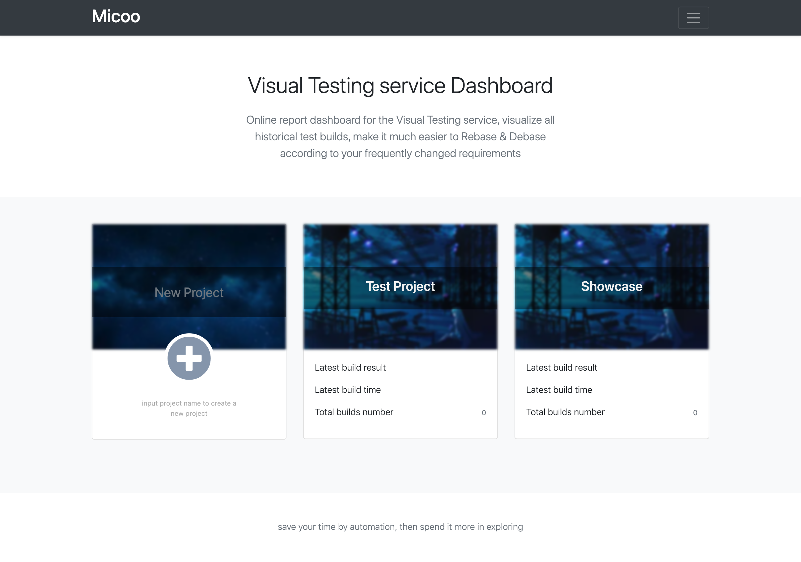

## About Micoo
[Micoo](https://github.com/Mikuu/Micoo) is a pixel based screenshots comparison solution for visual regression test, some characters Micoo provides:

* a web application, for inspecting test results, making visual mismatch decision and maintain baseline build,
* an engine service, for comparing the latest screenshots against baseline screenshots, based on pixel difference,
* a methodology, about how to do visual regression test with service,
* quick local setup and server side deployment with Docker Compose,

Micoo does `NOT`:
* take screenshots from your SUT application,
* process screenshots before doing visual comparison,
* provide Email notification for comparison mismatch,
* provide user management to distinguish `teams`,

So, what Micoo targets at is the most stable and straightforward function for comparing screenshots. Micoo is not, and probably, would never be a powerful thing, like `JVM`, but hope to be an always useful helper, like `string.replace()`.

## Installation

According to different purposes, there are 3 ways to launch Micoo as described below.

> all the below steps require the project [repository](https://github.com/Mikuu/Micoo) be cloned to your local, and all the commands are executed from the project's root path.

### launch with Docker images from Docker Hub

```commandline
cd env
docker-compose up
```

Then Micoo should be ready at `http://localhost:8123`.

This is the simplest approach to launch Micoo. You can always use the images from Docker Hub, unless you would like to launch Micoo with your own source code changes.

### launch with local source code

- create exchange directory

```commandline
mkdir exchange
npm install
```

- containerize micoo-nginx service

```commandline
cd env/nginx/containerize
./build-image.sh
```

- launch environment

```commandline
cd env
docker-compose -f docker-compose.env.yaml up
```

- start micoo-dashboard service

```commandline
cd dashboard
npm install
MICOO_DB_USERNAME=micoo-user export MICOO_DB_PASSWORD=micoo-password npm start
```

- start micoo-engine service

```commandline
cd engine
npm install
MICOO_DB_USERNAME=micoo-user export MICOO_DB_PASSWORD=micoo-password npm start
```

- start micoo-postern service

```commandline
cd postern
npm install
MICOO_DB_USERNAME=micoo-user export MICOO_DB_PASSWORD=micoo-password npm start
```

Then Micoo should be ready at `http://localhost:8123`.

With above commands, it should be successfully launch Micoo from the source code locally.

### launch with local docker images

once you have debugged your code change successfully, you can containerize them locally:

- containerize micoo-nginx service

```commandline
cd env/nginx/containerize
./build-image.sh
```

- containerize micoo-dashboard service

```commandline
cd dashboard
./build-image.sh
```

- containerize micoo-engine service

```commandline
cd engine
./build-image.sh
```

- containerize micoo-postern service

```commandline
cd postern
./build-image.sh
```

launch Micoo locally with your own docker images:

- launch all from local image

```commandline
cd env
docker-compose -f docker-compose.local.yaml up
```

Then Micoo should be ready at `http://localhost:8123`.

The last thing, if you wish, you can publish your own docker images to your private or cloud registry, e.g. AWS ECR, to share with teams.

## Usage

Once you have launched Micoo at your localhost, you could see its dashboard page at `http://localhost:8123` like this

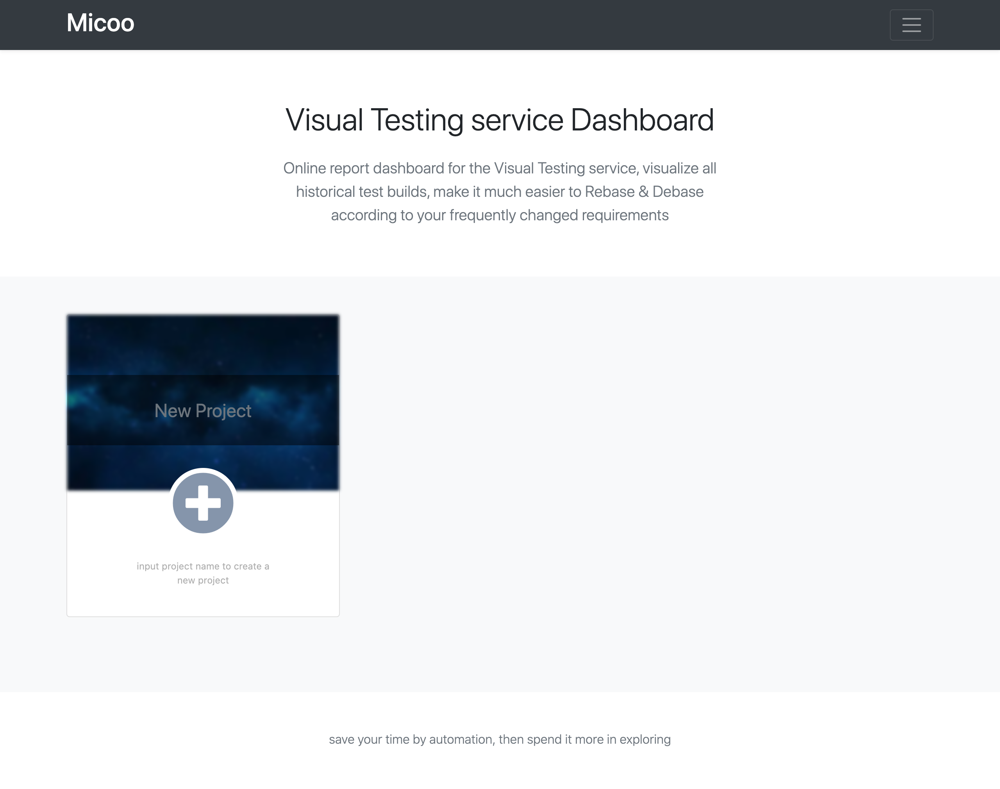

then, we can start our visual regression testing with Micoo.

### Create a Micoo project

First thing first, to create a new Micoo project, just input a project name and click the add button, you will get something like this

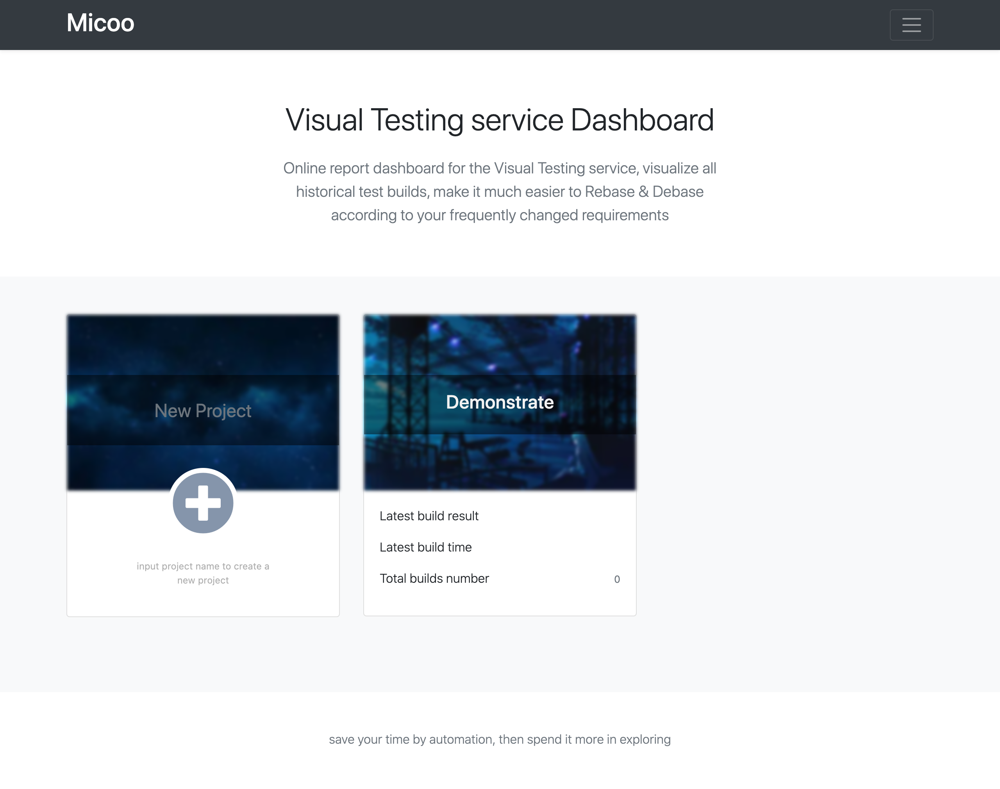

you can click the newly created project card to get into the project page, so far, it's an empty project, no test build.

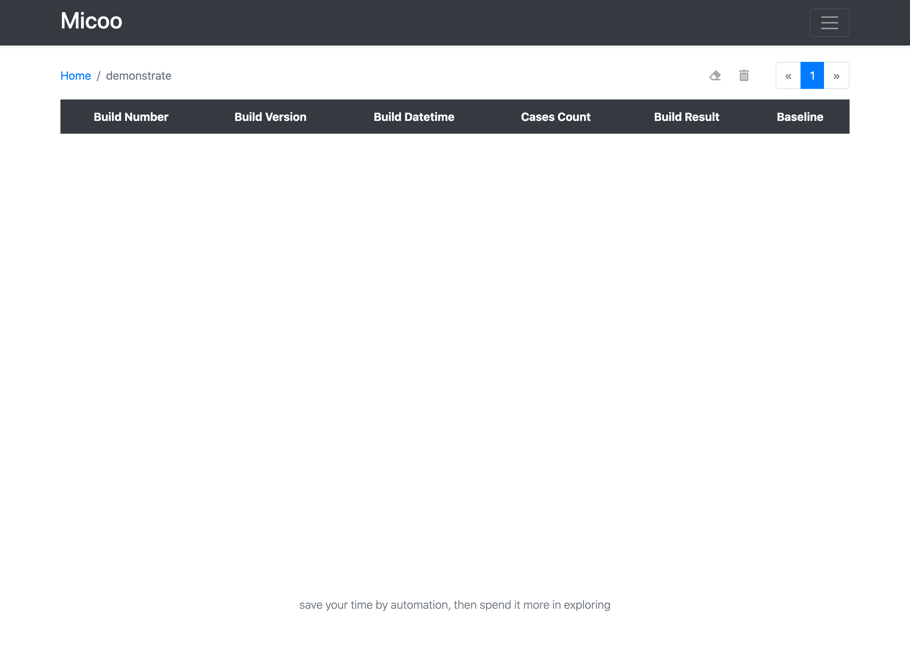

### Prepare SUT application screenshots

Micoo is designed to only focus on screenshots comparison, so the screenshots need be prepared by yourself, most of the case, by your UI automation tests. For this demonstration, let's use Puppeteer to simulate a quick Web application UI automation test.

- install Puppeteer

```commandline
mkdir -p my-test/screenshots
cd my-test
npm init
npm i puppeteer
```

- create test script

generate a test script `ui-test.js` and put in the below code

```javascript
const puppeteer = require('puppeteer');

(async () => {
  const browser = await puppeteer.launch({headless: false});
  const page = await browser.newPage();

  await page.goto('https://www.bing.com');
  await page.screenshot({path: 'screenshots/test-bing.png'});

  await page.goto('https://www.microsoft.com');
  await page.screenshot({path: 'screenshots/test-microsoft.png'});

  await browser.close();
})();
```
this test open browser to visit bing and microsoft's home pages, take screenshots and save them in folder `screenshots`.
> the screenshot filename would be used as test case name in Micoo, MUST in the form of [a-zA-Z0-9-_]+.png.

### Upload screenshots to Micoo and trigger visual comparision

Once we have all test screenshots ready, we can upload them to Micoo and trigger visual testing. To achieve that, we need us Micoo's client library,

```commandline
npm i micooc
```
then, we can create another script `visual-test.js`, and put in below codes

```javascript
const { newBuild } = require("micooc");

function test() {
  const host = "http://localhost:8123/engine";
  const pid = "PIDd9c19675fc864b34a74b97232fcc338a";
  const buildVersion = "5fafc0478af24af2da45fa19ddd06c17dd5d0d45";
  const screenshotDirectory = "./screenshots";

  newBuild(host, pid, buildVersion, screenshotDirectory);
}

test();
``` 
there is only one function `newBuild` we need call, and provide it 4 parameters
* `host` - the Micoo's base URL plus `/engine`,
* `pid` - your Micoo project's PID, it can be found from the Micoo project page's URL,
* `buildVersion` - this build version is neither parts of Micoo, nor your UI automation test, it needs to be the version of you SUT application, most of the case, it's the git revision number. `buildVersion` is a useful setup of mappings between your visual tests and the SUT application. Anyway, technically, it's just a string which will be displayed in Micoo's project board, you can use anything which is meaningful to you.
* `screenshotDirectory` - the directory where contains all screenshots to be uploaded, only `.png` file will be uploaded.

it's time to upload the screenshots and start the visual testing

```commandline
node visual-test.js
```
in terminal, you would probably get something like this

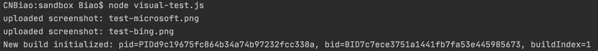

### Initialize Baseline

After you first upload, in Micoo project page, you would see something like this

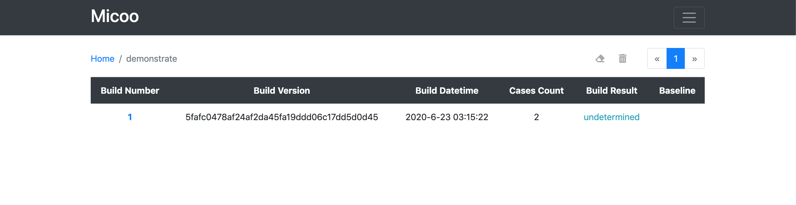

Every time when you upload a batch of screenshots, Micoo will take them as a `test build`, each of the
screenshots would be a `test case` with the case name from the screenshot filename.

Once a new test build created, the currently newly uploaded screenshot becomes test case's `latest` image, Micoo then try to find each test case's `baseline` image, to compare with the `latest` image, if there is any pixel mismatch, Micoo generates a `diff` image, all the `baseline`, `latest` and `diff` images will be displayed in Micoo test case page.

For now, since it's the first build we created, there is no baseline image, so test build's result and all test cases' results are marked as `undetermined`. Click build number can navigate to test build page.

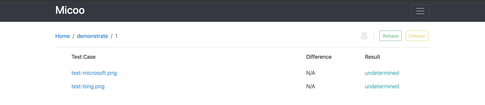

Click each test case name to open test case page, here you can view the uploaded screenshot, if they are correct, click the `Passed` button

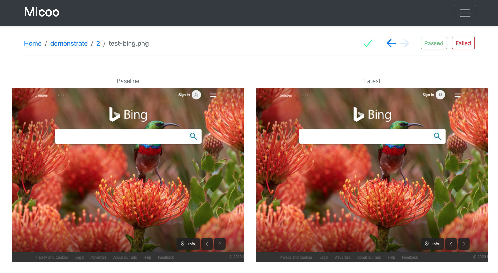

You can use `<-` and `->` to navigate between all test cases, once you passed all the test cases, click breadcrumb to go back to test build page, now, all test cases should be marked as `passed`. 

Click the `Rebase` button will tell Micoo to mark current build as a baseline build, all the screenshots in this build will be set as their test cases' baseline images. The same test case's latest image in the subsequent test build will be compared against these baseline images, until you rebase a newer baseline build, or rebase the current baseline build.

> only test build with all passed test cases can be marked as baseline build.

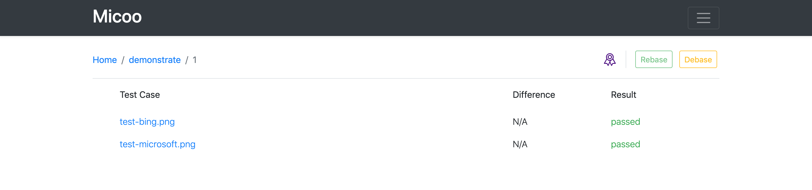

You can mark multiple and different test builds as baseline build, only the latest baseline build and its baseline screenshots take effect. If you click the `Rebase` button to rebase the latest baseline build, the previous baseline build, if exists, becomes the real baseline build.

This rebase and debase function give you ability to easily switch baseline among the latest and all previous test builds, this is quite useful, for example, set a baseline to a build which shouldn't be by mistake trigger, or even misunderstanding of the SUT application's design and implementation.

### Subsequent tests

Once you have a baseline build for the project, in your subsequent test, you only need to repetitively take screenshots (for different SUT application version) and upload them to Micoo, all the comparision will automatically happen.

Let's try upload the same screenshots again

```commandline
node visual-test.js
```
Now you will get a new test build and test cases passed

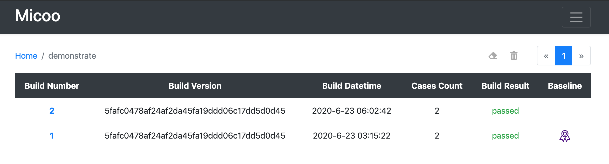


When there comes any mismatch between the latest screenshot and baseline screenshot, Micoo will find it and show you

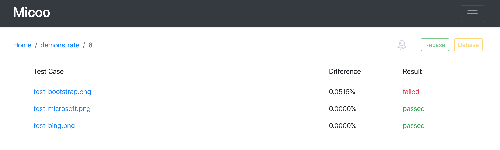

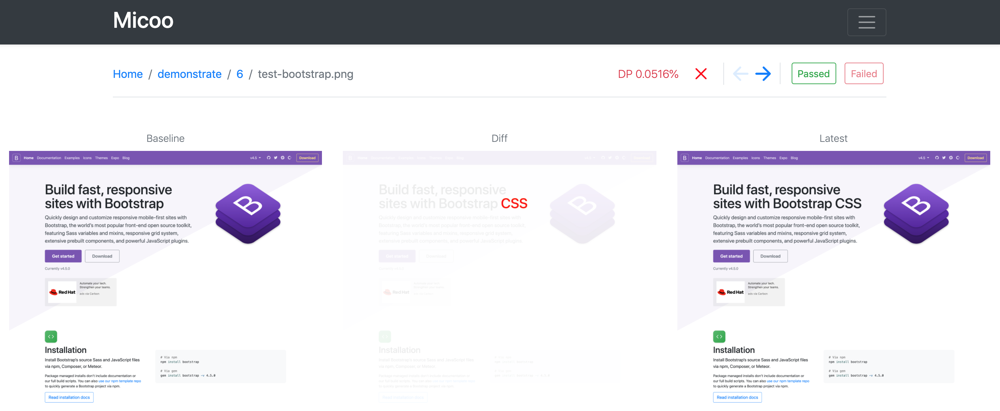

## Clients

Micoo is technically a service, to upload the screenshots, trigger new test build for comparision, we need call Micoo's API, these actions have been packaged in the Micoo Client.

### NodeJS

this is the first, and currently, only client we have. Hope I would have time and interest to create more language clients.

#### installation

```commandline
npm i micooc
```

#### usage

```javascript
const { newBuild } = require("micooc");

function test() {
  const host = "http://localhost:8123/engine";
  const pid = "PIDd9c19675fc864b34a74b97232fcc338a";
  const buildVersion = "5fafc0478af24af2da45fa19ddd06c17dd5d0d45";
  const screenshotDirectory = "./screenshots";

  newBuild(host, pid, buildVersion, screenshotDirectory);
}

test();
``` 
More information could be found in the Micoo [repository](https://github.com/Mikuu/Micoo/tree/master/clients/nodejs)

## CI integration

Play with localhost is not our goal, deploy on a server which is accessible to all your team members is the real direction for Micoo. Once you have done that, you can easily put visual test into automation tests in your CI.

### Test Stats

Before we talk about the CI setup, there is one more thing we need know, the test stats.

Micoo doesn't have any Email notification method to tell anyone on the comparision completeness, and if the result is passed or failed. This is not convenient to CI integration, so Micoo expose two API endpoints to get the test build stats.

#### get build stats

A GET request to `http://[micoo-host]:[port]/stats/build?bid=[bid]`, you will get something like this

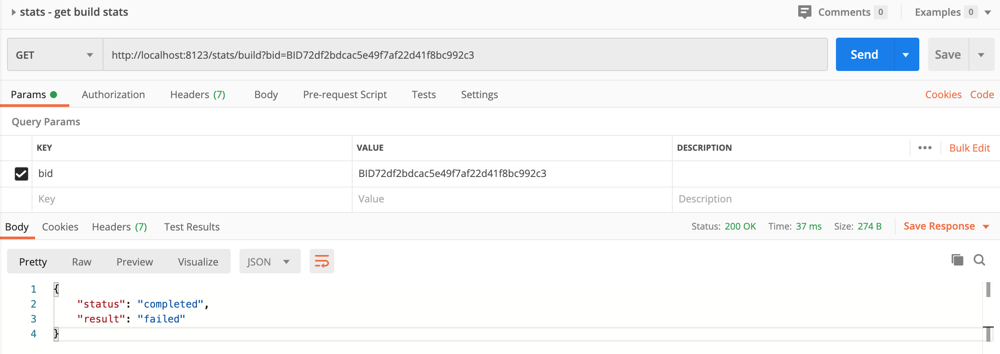

> every time when Micoo client uploads screenshots and trigger new test build, there would be a response which contains the newly created test build's `bid`.

#### get the latest build stats

Above endpoint `/stats/build` is only useful when it's able to get the `bid`, but if not, e.g. in your CI, it creates build in a Job/Stage/Step, but needs to fetch the stats in another Job/Stage/Step, and there is no way to share parameter between the two Jobs/Stags/Steps, then you could use the endpoint `/stats/build/latest`.

A GET request to `http://[micoo-host]:[port]/stats/build/latest?pid=[pid]`, you will get something like this

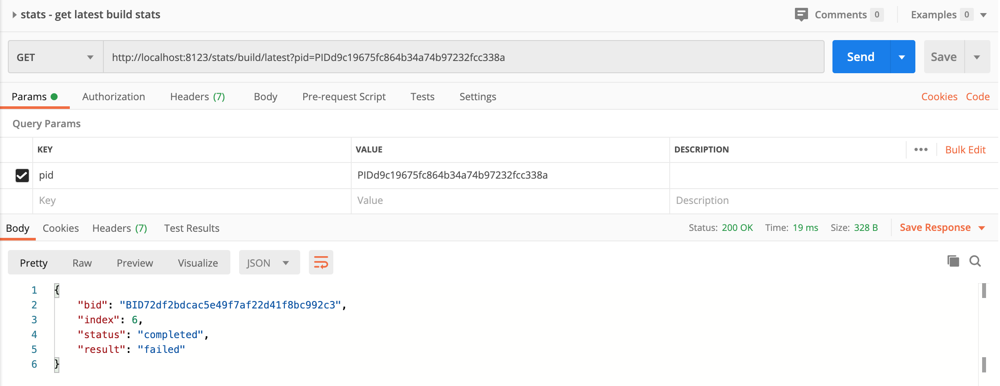

> `pid` could be picked up from the project page's URL. 

With above two endpoints, it should be enough to create code in any programming language you prefer, to fetch the test stats and result. 

### CI setup

Once we are able to get the test stats and result, it becomes blockless to add visual test into CI.

It's a huge topic on how to set up a functional and stable CI, so I'm not going to talk about that, the only thing I would suggest is how we can add visual test into CI pipeline setup, usually, there are two ways, `synchronized` and `unsynchronized`.

For all currently visual test solutions, including Micoo, it only detects and reports Mismatch, but Mismatch doesn't equal to Failure, e.g. the mismatch is a new requirement, or a bug fix, which would be rebase as a new baseline. Automation cannot make such decision, it must be judged by human. This brings the thinking-point as an interruption into the CI system, if you manually handle such interruption sequentially in CI, you are running a synchronized visual test pipeline, otherwise, handle it separately, you are running an unsynchronized visual test pipeline.

#### synchronized visual test setup in CI

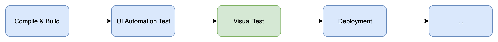

In the synchronized setup, if there is any mismatch found in visual-test stage, it blocks the CI pipeline, and need team member to check the result and take corresponding actions.

This setup brings high sensibility of the UI change, and ensure strict UI check before deployment, but somehow, decrease the pipeline's stability.

#### unsynchronized visual test setup in CI

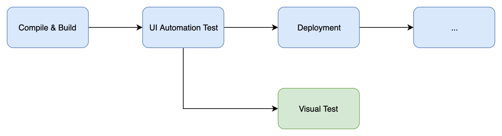

In the unsynchronized setup, once new code change passed the ui-automation-test, it would be deployed automatically, at the meanwhile, it triggers visual-test stage, if there is any mismatch, visual-test stage will fail but not impact deployment, and the mismatch need be checked separately.

This setup also brings high sensibility of the UI change, but loosen the UI check before deployment to provide higher stability.

